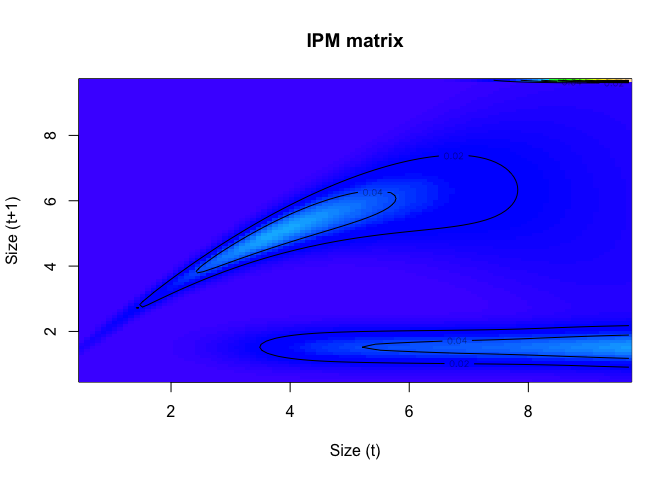
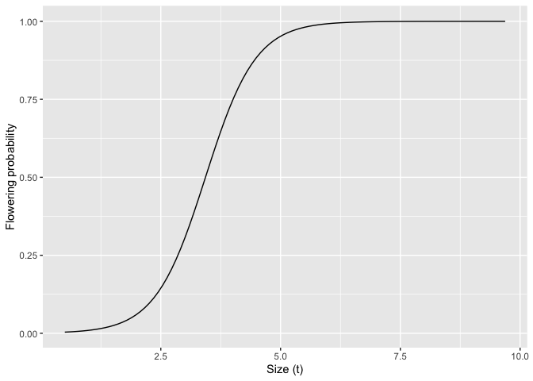

```r
library(ggplot2)
library(tidyverse)
```

```
## ── Attaching core tidyverse packages ──────────────────────── tidyverse 2.0.0 ──
## ✔ dplyr     1.1.2     ✔ readr     2.1.5
## ✔ forcats   1.0.0     ✔ stringr   1.5.1
## ✔ lubridate 1.9.2     ✔ tibble    3.2.1
## ✔ purrr     1.0.2     ✔ tidyr     1.3.0
## ── Conflicts ────────────────────────────────────────── tidyverse_conflicts() ──
## ✖ dplyr::filter() masks stats::filter()
## ✖ dplyr::lag()    masks stats::lag()
## ℹ Use the conflicted package (<http://conflicted.r-lib.org/>) to force all conflicts to become errors
```


Working through example in Appendix A of Merow et al. (2014) MEE.

Reading in the data. Data downloaded from <https://cmerow.github.io/RDataScience/21_Intro_IPMs.html>

## Data

Adults are stored at the beginning of the data set with values for size (measured in 2001) and sizeNext (measured in 2002). The number of seeds (fec.seed) and flowering status (fec.flower) were measured in 2001.


```r
d = read.csv("../Data/Intro_to_IPMs_Exercises_Data.csv")
head(d)
```

```
##   size sizeNext surv fec.seed fec.flower
## 1 3.09       NA    0       NA         NA
## 2 2.81       NA    0       NA         NA
## 3 4.46     6.07    1       15          1
## 4 1.68       NA    0       NA         NA
## 5 3.99       NA    0       NA         NA
## 6 4.07       NA    0       NA         NA
```

New recruits are stored at the end of the data frame and were only observed in the second survey (2002)


```r
tail(d)
```

```
##     size sizeNext surv fec.seed fec.flower
## 495   NA     1.78   NA       NA         NA
## 496   NA     1.01   NA       NA         NA
## 497   NA     1.68   NA       NA         NA
## 498   NA     1.44   NA       NA         NA
## 499   NA     1.08   NA       NA         NA
## 500   NA     1.62   NA       NA         NA
```

NAs used for missing or non-applicable data rather than 0 or some other indicator because this causes them to be automatically excluded from R's regression functions.

Description of model from manuscript: A long-lived perennial plant with no seedbank We assume that once seeds germinate, individuals grow until they are large enough to produce seeds, after which they continue to reproduce until they die. Growth, fecundity, and survival are all size-dependent. The individual components are typically only functions of z (e.g. survival, flowering probability, and seed number) and describe the number or proportion of individuals that follow the size redistribution component. Size redistribution components are functions of z' (and optionally z), because they describe the size of individuals in the next year (e.g. growth and recruit size distribution. )

-   The survival function, s(z), depends on the size of an individual at time t and describes the probability that an individual will survive to t + 1.
-   The growth function g(z'|z), describes the probability density of size z' that an individual of size z can grow to during one time step, conditional on having survived.
-   The fecundity kernel can be modeled as F(z'|z) = pflower(z) fseeds(z) pestab frecruitsize(z') where pflwoer(z) is the probability of flowering as a function of individual size z, fseeds(z) describes the number of seeds produced as function of individual size, and frecruitsize(z') describes the size distribution of recruits observed at t + 1. pestab is a 'black box' that describes the ratio of recruits observed at t + 1 compared with the seeds produced at 1. Taken together, pflower(z),fseeds(z) and pestab describe the production of recruits, which follow the size distribution frecruitsize(z').

## Plotting

Plotting survival, growth/shrinkage/stasis, number of seeds, and size of recruits as a function of our state variable, size.


```r
survival.plot=ggplot(d, aes(x = size, y = surv))+
  geom_point(position = "jitter")+
  xlab("Size (t)")+
  ylab("Survival to t+1")
survival.plot
```

```
## Warning: Removed 100 rows containing missing values or values outside the scale range
## (`geom_point()`).
```

<!-- -->

```r
sizenext.plot=ggplot(d, aes(x = size, y = sizeNext))+
  geom_point()+
  xlab("Size (t)")+
  ylab("Size to t+1")
sizenext.plot
```

```
## Warning: Removed 220 rows containing missing values or values outside the scale range
## (`geom_point()`).
```

<!-- -->

```r
fecund.plot=ggplot(d, aes(x = size, y = fec.seed))+
  geom_point()+
  xlab("Size (t)")+
  ylab("Seed Number")
fecund.plot
```

```
## Warning: Removed 220 rows containing missing values or values outside the scale range
## (`geom_point()`).
```

<!-- -->

```r
recruit.size = d %>%
  filter(is.na(size)) # only keep recruits which have NA for first size

recruit.size.plot=ggplot(recruit.size, aes(sizeNext))+
  geom_histogram(bins = 11, fill="white", color="black")
  xlab("Recruit Size")
```

```
## $x
## [1] "Recruit Size"
## 
## attr(,"class")
## [1] "labels"
```

```r
recruit.size.plot
```

<!-- -->

## Build regression for vital rate functions

Begin by setting up a data frame of the model parameters. These parameters will be estimated and recorded below.


```r
params = data.frame(surv.int=NA, # intercept from logistic regression of survival
                    surv.slope=NA, # slope from logistic regression of survival
                    growth.int=NA, # intercept from linear regression of growth
                    growth.slope=NA, # slope from linear regression of growth
                    growth.sd=NA, # residual sd from the linear regression of growth
                    seed.int=NA, # intercept from Poisson regression of seed number
                    seed.slope=NA, # slope from Poisson regressio of seed number
                    recruit.size.mean=NA, # mean recruit size
                    recruit.size.sd=NA, # standard deviation of recruit size
                    establishment.prob=NA) # probability of establishment
```

Next, we build each of the vital rate regressions and store the coefficients.

Survival data are binomial, with the possible outcomes either death(0) or survival(1), so it is modeleed with logistic regression (a generalized linear model with a binomial link function)


```r
# survival: logistic regression
surv.reg = glm(surv~size, data = d, family = binomial())
summary(surv.reg)
```

```
## 
## Call:
## glm(formula = surv ~ size, family = binomial(), data = d)
## 
## Deviance Residuals: 
##     Min       1Q   Median       3Q      Max  
## -2.2275  -0.5815   0.2491   0.5597   2.0972  
## 
## Coefficients:
##             Estimate Std. Error z value Pr(>|z|)    
## (Intercept)  -3.9646     0.4760  -8.329   <2e-16 ***
## size          1.2897     0.1338   9.642   <2e-16 ***
## ---
## Signif. codes:  0 '***' 0.001 '**' 0.01 '*' 0.05 '.' 0.1 ' ' 1
## 
## (Dispersion parameter for binomial family taken to be 1)
## 
##     Null deviance: 488.69  on 399  degrees of freedom
## Residual deviance: 315.82  on 398  degrees of freedom
##   (100 observations deleted due to missingness)
## AIC: 319.82
## 
## Number of Fisher Scoring iterations: 5
```


```r
params$surv.int = coefficients(surv.reg)[1]
params$surv.slope = coefficients(surv.reg)[2]
```

Growth is often modelled with a linear regression, which is taken as the mean of normal (or log-normal) distribution. The linear regression describes the expected size at the next census while the normal distribution describes the range of possible sizes about this expectation. The variance of the normal distribution is often taken to be equal to the variance of the residuals from the linear regression.


```r
# growth: linear regression
growth.reg = lm(sizeNext~size, data = d)
summary(growth.reg)
```

```
## 
## Call:
## lm(formula = sizeNext ~ size, data = d)
## 
## Residuals:
##     Min      1Q  Median      3Q     Max 
## -3.8037 -0.5434  0.0932  0.5741  2.6732 
## 
## Coefficients:
##             Estimate Std. Error t value Pr(>|t|)    
## (Intercept)  2.68135    0.19580   13.69   <2e-16 ***
## size         0.57922    0.03902   14.84   <2e-16 ***
## ---
## Signif. codes:  0 '***' 0.001 '**' 0.01 '*' 0.05 '.' 0.1 ' ' 1
## 
## Residual standard error: 0.8866 on 278 degrees of freedom
##   (220 observations deleted due to missingness)
## Multiple R-squared:  0.4421,	Adjusted R-squared:  0.4401 
## F-statistic: 220.3 on 1 and 278 DF,  p-value: < 2.2e-16
```


```r
params$growth.int = coefficients(growth.reg)[1]
params$growth.slope = coefficients(growth.reg)[2]
params$growth.sd = sd(resid(growth.reg))
```

For fecundity, we are pooling all individuals into this regression regardless of whether they flowered or not. The number of offspring is typically treated as count data and modelled using Poisson regression (a generalized linear model with a log link function).


```r
# seeds: Poisson regression
seed.reg = glm(fec.seed~size, data = d, family = poisson())
summary(seed.reg)
```

```
## 
## Call:
## glm(formula = fec.seed ~ size, family = poisson(), data = d)
## 
## Deviance Residuals: 
##     Min       1Q   Median       3Q      Max  
## -6.5338  -1.8830   0.0529   1.5375   4.9690  
## 
## Coefficients:
##             Estimate Std. Error z value Pr(>|z|)    
## (Intercept)  1.33234    0.06370   20.92   <2e-16 ***
## size         0.30647    0.01164   26.34   <2e-16 ***
## ---
## Signif. codes:  0 '***' 0.001 '**' 0.01 '*' 0.05 '.' 0.1 ' ' 1
## 
## (Dispersion parameter for poisson family taken to be 1)
## 
##     Null deviance: 2598.3  on 279  degrees of freedom
## Residual deviance: 1840.1  on 278  degrees of freedom
##   (220 observations deleted due to missingness)
## AIC: 2942.2
## 
## Number of Fisher Scoring iterations: 5
```


```r
params$seed.int = coefficients(seed.reg)[1]
params$seed.slope = coefficients(seed.reg)[2]
```

In the data frame, recruits are those individuals who have a value for sizeNext but not for size. We simply take the mean and standard deviation of their size for use in a normal distribution. We assume that offspring size is independent of maternal size so we only need to describe the distribution of offspring in terms of its mean and variance. 

When parentage is unknown, it is common to model the size distribution of recruits as a normal or log-normal distribution fit tot he sizes of recruits at t+1.


```r
# Size distribution of recruits
params$recruit.size.mean = mean(recruit.size$sizeNext)
params$recruit.size.sd = sd(recruit.size$sizeNext)
```

These data represent a single year's worth of data, hence establishment probability can be estimated by dividing the number of observed recruits by the number of seeds. The growth/survival measurements were taken in year 1 whereas the recruit sizes were measured in year t+1. Importantly, this calculation ignores all the processes that might lead to seed loss.

Many vital rates that enter the individual component of the kernel, such as germination or recruitment probability, are commonly modelled as constants either because they are size-independent or there are insufficient data to determine the size dependence.


```r
# establishment probability
params$establishment.prob = sum(is.na(d$size))/sum(d$fec.seed,na.rm = TRUE)
```

## Plotting models

Compare each of the vital rate models (red lines) ot the data


```r
newdata=data.frame(size=seq(0,8,by=.01)) # sizes at which to evaluate predictions

newdata$surv.preds = predict(surv.reg, newdata = newdata,type = "response")
newdata$growth.preds = predict(growth.reg, newdata = newdata)
newdata$seed.preds = predict(seed.reg, newdata=newdata, type = "response")

survival.plot=ggplot(d, aes(x = size, y = surv))+
  geom_point(position = "jitter")+
  geom_line(data = newdata, aes(x = size, y= surv.preds), col="red", linewidth=3)+
  xlab("Size (t)")+
  ylab("Survival to t+1")
survival.plot
```

```
## Warning: Removed 100 rows containing missing values or values outside the scale range
## (`geom_point()`).
```

<!-- -->

```r
sizenext.plot=ggplot(d, aes(x = size, y = sizeNext))+
  geom_point()+
  geom_line(data = newdata, aes(x = size, y= growth.preds), col="red", linewidth=3)+
  xlab("Size (t)")+
  ylab("Size to t+1")
sizenext.plot
```

```
## Warning: Removed 220 rows containing missing values or values outside the scale range
## (`geom_point()`).
```

<!-- -->

```r
fecund.plot=ggplot(d, aes(x = size, y = fec.seed))+
  geom_point()+
  geom_line(data = newdata, aes(x = size, y= seed.preds), col="red", linewidth=3)+
  xlab("Size (t)")+
  ylab("Seed Number")
fecund.plot
```

```
## Warning: Removed 220 rows containing missing values or values outside the scale range
## (`geom_point()`).
```

<!-- -->

```r
recruit.size = d %>%
  filter(is.na(size)) # only keep recruits which have NA for first size

xx=seq(0,8,by=.01) # sizes at which to evaluate predictions

recruit.size.plot=ggplot(recruit.size, aes(x = sizeNext))+
  geom_histogram(aes(y = ..density..), bins = 11, col = "black", fill = "white")+
  xlab("Recruit Size")+
  stat_function(fun=function(xx) dnorm(xx, mean = params$recruit.size.mean, sd = params$recruit.size.sd), col="red", linewidth=3)
recruit.size.plot
```

```
## Warning: The dot-dot notation (`..density..`) was deprecated in ggplot2 3.4.0.
## ℹ Please use `after_stat(density)` instead.
## This warning is displayed once every 8 hours.
## Call `lifecycle::last_lifecycle_warnings()` to see where this warning was
## generated.
```

<!-- -->

## Describe functions to describe life history

Each of the functions below represents one or more of the vital rates. These functions are used to build the IPM using output (the coefficients) from the regressions developed above. These functions represent the modeler's decision about how to decompose the life cycle. 

In this very simple example, we model (1) survival, (2) growth, (3) seed number, (4) the seedling size distribution, and (5) the establishment probability. In practice the regression building section and this section are iterative and should inform one another. For example, the level of detail included in the life history models can be determined by the data availability and quality of the candidate vital rate regressions. 


```r
# survival probability function, this is a logistic function
s.x = function(x, params){
  u = exp(params$surv.int+params$surv.slope*x)
  return(u/(1+u))
}
```


```r
# growth function, this is a normal distribution
g.yx = function(xp,x,params){
  dnorm(xp, mean = params$growth.int+params$growth.slope*x, sd = params$growth.sd)
}
```


```r
# reproduction function, this is a constant times a normal distribution times an exponential function
f.yx = function(xp,x,params){
  params$establishment.prob*dnorm(xp,mean = params$recruit.size.mean, sd = params$recruit.size.sd)*exp(params$seed.int+params$seed.slope*x)
}
```

## Make a kernel

Combine the vital rate functions to build the discretized IPM kernel which we'll call the IPM matrix. Steps typically performed in IPMpack package (not maintained on CRAN). 

To integrate, we begin by defining:

* the boundary point (b; the edges of the cells defining the matrix)
* mesh points (y; the centers of the cells defining the matrix and the points at which the matrix is evaluated for the midpoint rule of numerical integration)
* step size (h; the widths of the cells)
* the integration limits (min.size and max. size) span the range of sizes observed int eh ata set, and then some.


```r
min.size = 0.9*min(c(d$size,d$sizeNext),na.rm = T)
max.size = 1.1*max(c(d$size,d$sizeNext),na.rm = T)
n = 100 # number of cells in the matrix # typically between 50 and 200
b = min.size+c(0:n)*(max.size-min.size)/n # boundary points
y = 0.5*(b[1:n]+b[2:(n+1)]) # mesh points
h = y[2]-y[1] # step size
```

Make the IPM matrices. The function outer() evaluates the matrix at all pairwise combinations of the two vectors y and y and returns matrices representing the kernel components for growth and fecundity, respectively. For the numerical integration, we're using the midpoint rule to estimate the area under a curve. The midpoint rule assumes a rectangular approximation. The heights of the rectangles are given by the outer function and the width of the rectangles is h.


```r
G = h*outer(y,y,g.yx,params = params) # growth matrix
S = s.x(y, params = params) # survival
F = h*outer(y,y,f.yx, params = params) # reproductive matrix
P = G # placeholder, redefine P on the next line
for(i in 1:n) P[,i] = G[,i]*S[i] # growth/survival matrix
K = P + F # full matrix
```

The result is a 100 x 100 cell discretization of the kernel, K. We can now apply the tools for matrix population models to K

## Plotting kernels


```r
image(y,y,t(G), main = "growth kernel")
```

<!-- -->

```r
ggplot(data = cbind(y,S), aes(x = y, y = S))+
  geom_line()+
  ggtitle("survival")
```

<!-- -->

```r
image(y,y,t(P), main = "survival/growth kernel")
abline(0,1,lwd=3) # 1:1 line represents stasis
```

<!-- -->

```r
image(y,y,t(F), main = "fecundity kernel")
```

<!-- -->

```r
image(y,y,t(K), main = "full kernel")
```

<!-- -->

```r
image(y,y,t(K)^0.3, main = "full kernel^0.3") # trick to level out the kernel to see fecundity and growth/survival
```

<!-- -->

The outer function takes all pairwise combinations of the first argument (y) with the second (also y), and does some operation to those combinations. Here are some examples


```r
tmp1=outer(y,y,'+')
image(y,y,t(tmp1))
```

<!-- -->


```r
tmp2=outer(y,y,'*')
image(y,y,t(tmp2))
```

<!-- -->


```r
tmp3=outer(y,exp(y),'+')
image(y,exp(y),t(tmp3))
```

<!-- -->


## Basic analyses

Analyses usually begin with obtaining the eigenvalues (lambda) and eigenvectors (v-left; w-right) fo the matrix. These are useful for understanding the asymptotic dynamics. The dominant eigenvalue gives the asymptotic population growth rate (lam). The right eigenvector gives the stable stage distribution and the left eigenvector gives the reproductive value, when normalized. 


```r
lam = Re(eigen(K)$values[1])
lam
```

```
## [1] 1.013391
```

```r
w.eigen = Re(eigen(K)$vectors[,1])
stable.dist = w.eigen/sum(w.eigen)
v.eigen = Re(eigen(t(K))$vectors[,1])
repro.val = v.eigen/v.eigen[1]
```

The eigen-things can be combined to obtain the sensitivity and elasticity matrices.


```r
v.dot.w = sum(stable.dist*repro.val)*h
sens = outer(repro.val,stable.dist)/v.dot.w
elas = matrix(as.vector(sens)*as.vector(K)/lam,nrow = n)
```

## Plot the results

Plotting results for stable size distribution, reproductive values, elasticity, sensitivity


```r
image(y,y,t(K), xlab = "Size (t)", ylab = "Size (t+1)", col = topo.colors(100), main = "IPM matrix")
contour(y,y,t(K), add = TRUE, drawlabels = TRUE)
```

<!-- -->

```r
ggplot(data = cbind(y,stable.dist), aes(x = y, y = stable.dist))+
  geom_line()+
  ggtitle("Stable size distributions")
```

<!-- -->

```r
ggplot(data = cbind(y,repro.val), aes(x = y, y = repro.val))+
  geom_line()+
  ggtitle("Reproductive values")
```

<!-- -->

```r
image(y,y,t(elas), xlab = "Size (t)", ylab = "Size (t+1)", main = "Elasticity")
```

<!-- -->

```r
image(y,y,t(sens), xlab = "Size (t)", ylab = "Size (t+1)", main = "Sensitivity")
```

<!-- -->

## Improving the model

Typically, the workflow for building IPMs is iterative; based on preliminary analyses, we determine which important factors are missing or superfluous in the models. In this section, we make three improvements: (1) we make the variance in growth among individuals a function of size (i.e. growth is more variable in larger individuals); (2) add a quadratic term for size to the growth function to capture the plateauing pattern in the growth data; (3) modify the fecundity function to include flowering probability, thereby recognizing that not all individuals reproduce.

First, we make the variance of the growth regression a function of size and obtain the value of lambda. In the model above, we simply modeled the variance as constant. By looking at the growth data, you might guess that the variance increases as a function of size. 


```r
ggplot(data = as.data.frame(cbind(growth.reg$model$size, abs(resid(growth.reg)))), aes(x = V1, y = V2))+
  geom_point()+
  xlab("size")+
  ylab("residual")
```

<!-- -->

Incorporating nonuniform variance in the size distribution requires 4 steps. 

(1) Build a regression on the residuals of the growth regression as a function of size. We will model the variance in growth as an exponential function. The mean doesn't change much from the previous model, the effect of the GLS model is to modify the variance


```r
library(nlme)
```

```
## 
## Attaching package: 'nlme'
```

```
## The following object is masked from 'package:dplyr':
## 
##     collapse
```

```r
growth.reg = gls(sizeNext~size, weights = varExp(), na.action = na.omit, data = d)
summary(growth.reg)
```

```
## Generalized least squares fit by REML
##   Model: sizeNext ~ size 
##   Data: d 
##       AIC      BIC   logLik
##   711.298 725.8085 -351.649
## 
## Variance function:
##  Structure: Exponential of variance covariate
##  Formula: ~fitted(.) 
##  Parameter estimates:
##     expon 
## 0.2935594 
## 
## Coefficients:
##                 Value  Std.Error  t-value p-value
## (Intercept) 2.3280286 0.14227273 16.36314       0
## size        0.6585909 0.03301602 19.94762       0
## 
##  Correlation: 
##      (Intr)
## size -0.945
## 
## Standardized residuals:
##         Min          Q1         Med          Q3         Max 
## -3.29676786 -0.68003669  0.07382739  0.69180794  3.35550523 
## 
## Residual standard error: 0.1664024 
## Degrees of freedom: 280 total; 278 residual
```

```r
xx=data.frame(size=seq(0,8,by=.01)) # sizes at which to evaluate predictions

xx$growth.preds = predict(growth.reg, newdata = xx)

ggplot(data = d, aes(x = size, y = sizeNext))+
  geom_point()+
  ggtitle("Growth/Shrinkage/Stasis")+
  geom_line(data = xx, aes(x = size, y = growth.preds), col = "red", linewidth = 3)
```

```
## Warning: Removed 220 rows containing missing values or values outside the scale range
## (`geom_point()`).
```

<!-- -->

(2) Modify the params data frame to have coefficients growth.sd.int and growth.sd.slope and set the values of those coefficients equal to the appropriate coefficients from part (1).


```r
params$growth.int=coefficients(growth.reg)[1]
params$growth.slope=coefficients(growth.reg)[2]
params$growth.sigma2=summary(growth.reg)$sigma^2
params$growth.sigma2.exp=as.numeric(growth.reg$modelStruct$varStruct)
```

(3) Modify the growth function, g.xy(), to allow the standard deviation argument, sd, to be a function of size. This will allow a similar pattern to the arguement for mean. 


```r
g.yx=function(xp,x,params) {
dnorm(xp,mean=params$growth.int+params$growth.slope*x,
sd=sqrt(params$growth.sigma2*exp(2*params$growth.sigma2.exp*x)))
}
```

(4) Rerun the code to obtain lambda, sensistivies and elasticities


```r
G=h*outer(y,y,g.yx,params=params) # growth matrix
S=s.x(y,params=params) # survival
P=G # placeholder; redefine P on the next line
for(i in 1:n) P[,i]=G[,i]*S[i] # growth/survival matrix
F=h*outer(y,y,f.yx,params=params) # reproduction matrix
K=P+F # full matrix
```


```r
(lam=Re(eigen(K)$values[1])) # new population growth rate
```

```
## [1] 0.980247
```

```r
w.eigen=Re(eigen(K)$vectors[,1])
stable.dist=w.eigen/sum(w.eigen)
v.eigen=Re(eigen(t(K))$vectors[,1])
repro.val=v.eigen/v.eigen[1]
v.dot.w=sum(stable.dist*repro.val)*h
sens=outer(repro.val,stable.dist)/v.dot.w
elas=matrix(as.vector(sens)*as.vector(K)/lam,nrow=n)
```

Plot the results


```r
image(y,y,t(K), xlab="Size (t)",ylab="Size (t+1)",
col=topo.colors(100), main="IPM matrix")
contour(y,y,t(K), add = TRUE, drawlabels = TRUE)
```

<!-- -->

```r
ggplot(data = cbind(y,stable.dist), aes(x = y, y = stable.dist))+
  geom_line()+
  ggtitle("Stable size distributions")
```

<!-- -->

```r
ggplot(data = cbind(y,repro.val), aes(x = y, y = repro.val))+
  geom_line()+
  ggtitle("Reproductive values")
```

<!-- -->

```r
image(y,y,t(elas),xlab="Size (t)",ylab="Size (t+1)",main="Elasticity")
```

<!-- -->

```r
image(y,y,t(sens),xlab="Size (t)",ylab="Size (t+1)", main="Sensitivity")
```

<!-- -->


Eviction: We begin by checking for unintentional eviction, wherein individuals transition beyond the size range chosen for the model, leading to inaccurate representation of the survival model. Because the growth function and offspring size distribution are Gaussian probability densities, they range from -inf to +inf. Because of how we have defined the model, most of that probability for both functions falls between the minimym and maximum values of size that we've chosen for the model (0.45 and 9.735, respectively), but not all of it. If we ignore the parts of these densities taht fall outside the integration limits, individuals are 'evicted from the model' and survival is incorrectly estimated. To check for eviction, we plot the survival model and the column sums of the survival/growth (P) matrix. In the plot, we can see that eviction occurs for large individuals (size > 9) because the column sums are lower than the survival models suggests that they should be. 


```r
ggplot(data = as.data.frame(cbind(y,s.x(y,params))), aes(x = y, y = V2))+
  geom_line(lwd=3)+
  xlab("Size")+
  ylab("Survival Probabily")+
  geom_point(data = as.data.frame(cbind(y,apply(P,2,sum))), aes(x = y, y = V2), col = "red", lwd = 3, pch = 19, cex = 0.1)
```

```
## Warning in geom_point(data = as.data.frame(cbind(y, apply(P, 2, sum))), :
## Ignoring unknown parameters: `linewidth`
```

<!-- -->

One way to correct for eviction is to return the evicted individuals to the cells at the boundaries where they were evicted. All individuals smaller than the lower integration limit are assigned to the smallest size class. This mainly affects the offspring size distributions; it sets a lower limit on offspring size. Similarly, all individuals larger than the upper integration limit can be assigned to the largest size class. This mainly affects the growth function, when individuals in the largest size class are still able to grow. To apply this approach, we need to modify the growth matrix before combining the growth/survival and fecundity matrices. In the following modification of the code to construct the matrix, there are two loops: one that corrects for eviction of offspring and one that corrects for eviction of adults.


```r
G=h*outer(y,y,g.yx,params=params) # growth matrix
S=s.x(y,params=params)
P=G
# fix eviction of offspring
for(i in 1:(n/2)) {
G[1,i]<-G[1,i]+1-sum(G[,i])
P[,i]<-G[,i]*S[i]
}
# fix eviction of large adults
for(i in (n/2+1):n) {
G[n,i]<-G[n,i]+1-sum(G[,i])
P[,i]<-G[,i]*S[i]
}
F=h*outer(y,y,f.yx,params=params) # reproduction matrix
K=P+F # full matrix
(lam=Re(eigen(K)$values[1])) # new population growth rate
```

```
## [1] 1.013069
```


```r
ggplot(data = as.data.frame(cbind(y,s.x(y,params))), aes(x = y, y = V2))+
  geom_line(lwd=3)+
  xlab("Size")+
  ylab("Survival Probabily")+
  geom_point(data = as.data.frame(cbind(y,apply(P,2,sum))), aes(x = y, y = V2), col = "red", lwd = 3, pch = 19, cex = 0.1)
```

```
## Warning in geom_point(data = as.data.frame(cbind(y, apply(P, 2, sum))), :
## Ignoring unknown parameters: `linewidth`
```

<!-- -->

Quadratic Growth Function: The next improvement to the IPM is to add a quadratic term to the growth regression to capture a slight downward curve pattern in growth. For simplicity, we keep the size dependence of the growth variance from the previous section in the model, but note that we rerun the variance regressions since the residuals will change when the quadratic term is added to the model 


```r
growth.reg=gls(sizeNext~size+I(size^2),weights=varExp(), na.action=na.omit, data=d)
summary(growth.reg)
```

```
## Generalized least squares fit by REML
##   Model: sizeNext ~ size + I(size^2) 
##   Data: d 
##        AIC      BIC    logLik
##   698.7273 716.8474 -344.3636
## 
## Variance function:
##  Structure: Exponential of variance covariate
##  Formula: ~fitted(.) 
##  Parameter estimates:
##     expon 
## 0.3526462 
## 
## Coefficients:
##                  Value Std.Error   t-value p-value
## (Intercept)  0.7802238 0.3208072  2.432065  0.0156
## size         1.4981985 0.1704046  8.792009  0.0000
## I(size^2)   -0.1007464 0.0204990 -4.914706  0.0000
## 
##  Correlation: 
##           (Intr) size  
## size      -0.972       
## I(size^2)  0.925 -0.985
## 
## Standardized residuals:
##         Min          Q1         Med          Q3         Max 
## -3.26750298 -0.63630063  0.06390183  0.62856672  3.02974171 
## 
## Residual standard error: 0.11715 
## Degrees of freedom: 280 total; 277 residual
```


```r
params$growth.int=coefficients(growth.reg)[1]
params$growth.slope=coefficients(growth.reg)[2]
params$growth.sqrd=coefficients(growth.reg)[3]
params$growth.sigma2=summary(growth.reg)$sigma^2
params$growth.sigma2.exp=as.numeric(growth.reg$modelStruct$varStruct)
```


```r
g.yx=function(xp,x,params) {
dnorm(xp,
mean=params$growth.int+params$growth.slope*x+params$growth.sqrd*x^2,
sd=sqrt(params$growth.sigma2*exp(2*params$growth.sigma2.exp*x)))
}
```

We rerun the code to build the matrix to obtain lambda, sensitivies, and elasticities.


```r
G=h*outer(y,y,g.yx,params=params) # growth matrix
S=s.x(y,params=params) # survival
P=G # placeholder; redefine P on the next line
# fix eviction of offspring
for(i in 1:(n/2)) {
G[1,i]<-G[1,i]+1-sum(G[,i])
P[,i]<-G[,i]*S[i]
}
# fix eviction of large adults
for(i in (n/2+1):n) {
G[n,i]<-G[n,i]+1-sum(G[,i])
P[,i]<-G[,i]*S[i]
}

F=h*outer(y,y,f.yx,params=params) # reproduction matrix
K=P+F # full matrix
(lam=Re(eigen(K)$values[1])) # new population growth rat
```

```
## [1] 0.9835344
```


```r
w.eigen=Re(eigen(K)$vectors[,1])
stable.dist=w.eigen/sum(w.eigen)
v.eigen=Re(eigen(t(K))$vectors[,1])
repro.val=v.eigen/v.eigen[1]
v.dot.w=sum(stable.dist*repro.val)*h
sens=outer(repro.val,stable.dist)/v.dot.w
elas=matrix(as.vector(sens)*as.vector(K)/lam,nrow=n)
```

The new model prevents individuals from growing continuously and sets an (asymptotic) upper limit on size where the growth regression crosses the 1:1 line. Because individuals cannot grow continuously in the model, there is now more mass in the "adult" portion of the stable stage distribution (sizes > 4), because there are no longer very large individuals in the population, who previously were producing a very large number of offspring in the model. Not surprisingly, there is slightly greater sensitivity/elasticity to survival of individuals reaching sizes near 6, corresponding to the largest individuals in the current model.


```r
image(y,y,t(K), xlab="Size (t)",ylab="Size (t+1)",
col=topo.colors(100), main="IPM matrix")
contour(y,y,t(K), add = TRUE, drawlabels = TRUE)
```

<!-- -->

```r
ggplot(data = cbind(y,stable.dist), aes(x = y, y = stable.dist))+
  geom_line()+
  ggtitle("Stable size distributions")
```

<!-- -->

```r
ggplot(data = cbind(y,repro.val), aes(x = y, y = repro.val))+
  geom_line()+
  ggtitle("Reproductive values")
```

<!-- -->

```r
image(y,y,t(elas),xlab="Size (t)",ylab="Size (t+1)",main="Elasticity")
```

<!-- -->

```r
image(y,y,t(sens),xlab="Size (t)",ylab="Size (t+1)", main="Sensitivity")
```

<!-- -->

Flowering Probability: Two issues at play. One is that we know the biology and expect larger individuals to flower more. The other is that the data don't support the form of the original model. More generally, it is not a good idea to combine multiple processes into a single function, as this makes it hard to model the data. Consider the case where the plant does not flower each year, perhaps dependent on stress deriving from some environmental factor. We expect that larger plants are more likely to flower because they can maintain a sufficient amount of stored resources to buffer against environmental variation. We might not know what triggers the decision to flower, but we can at least describe its size dependence by including the probability of flowering in the model. The flowering probability function will enter the reproduction kernal (called f.xy()). The version of f.xy() used above simply assumes that all plants flower, so including the flowering probability function will reduce this number. Including a flowering probability in the model requires 5 steps.

(1) Write the flowering probability function. Most easily modeled using logistic regression.


```r
p.flower.x=function(x,params) {
u=exp(params$flower.int+params$flower.slope*x)
return(u/(1+u))
}
```

(2) Modify the reproduction function (f.xy) to include the flowering probability function. This just amounts to mulitplying the argument in f.xy by p.flower.x


```r
f.yx=function(xp,x,params) {
p.flower.x(x,params)*
params$establishment.prob*
dnorm(xp,mean=params$recruit.size.mean,sd=params$recruit.size.sd)*
exp(params$seed.int+params$seed.slope*x)
}
```

(3) Fit a logistic regression for flowering probability


```r
flower.reg=glm(fec.flower~size,data=d,family=binomial())
summary(flower.reg)
```

```
## 
## Call:
## glm(formula = fec.flower ~ size, family = binomial(), data = d)
## 
## Deviance Residuals: 
##      Min        1Q    Median        3Q       Max  
## -2.90763   0.05881   0.16048   0.39906   1.94232  
## 
## Coefficients:
##             Estimate Std. Error z value Pr(>|z|)    
## (Intercept)  -6.5495     0.9564  -6.848 7.48e-12 ***
## size          1.9081     0.2465   7.740 9.92e-15 ***
## ---
## Signif. codes:  0 '***' 0.001 '**' 0.01 '*' 0.05 '.' 0.1 ' ' 1
## 
## (Dispersion parameter for binomial family taken to be 1)
## 
##     Null deviance: 285.68  on 279  degrees of freedom
## Residual deviance: 144.30  on 278  degrees of freedom
##   (220 observations deleted due to missingness)
## AIC: 148.3
## 
## Number of Fisher Scoring iterations: 6
```

```r
params$flower.int=coefficients(flower.reg)[1]
params$flower.slope=coefficients(flower.reg)[2]
```

(4) Update the regression for seed number to include only the individuals that flowered


```r
seed.reg=glm(fec.seed~size,data=d[d$fec.flower==1,],family=poisson())
summary(seed.reg)
```

```
## 
## Call:
## glm(formula = fec.seed ~ size, family = poisson(), data = d[d$fec.flower == 
##     1, ])
## 
## Deviance Residuals: 
##      Min        1Q    Median        3Q       Max  
## -2.54532  -0.76716   0.03013   0.66809   2.98617  
## 
## Coefficients:
##             Estimate Std. Error z value Pr(>|z|)    
## (Intercept)  2.85617    0.07447  38.353  < 2e-16 ***
## size         0.05076    0.01370   3.706  0.00021 ***
## ---
## Signif. codes:  0 '***' 0.001 '**' 0.01 '*' 0.05 '.' 0.1 ' ' 1
## 
## (Dispersion parameter for poisson family taken to be 1)
## 
##     Null deviance: 250.71  on 221  degrees of freedom
## Residual deviance: 236.90  on 220  degrees of freedom
##   (220 observations deleted due to missingness)
## AIC: 1339
## 
## Number of Fisher Scoring iterations: 4
```

```r
params$seed.int=coefficients(seed.reg)[1]
params$seed.slope=coefficients(seed.reg)[2]
```

(5) Rerun code to obtain lambda, sensitivites, and elasticities. Note that lambda decreases slighly because fewer individuals reproducce. 


```r
G=h*outer(y,y,g.yx,params=params) # growth matrix
S=s.x(y,params=params) # survival
P=G # placeholder; redefine P on the next line
# fix eviction of offspring
for(i in 1:(n/2)) {
G[1,i]<-G[1,i]+1-sum(G[,i])
P[,i]<-G[,i]*S[i]
}
# fix eviction of large adults
for(i in (n/2+1):n) {
G[n,i]<-G[n,i]+1-sum(G[,i])
P[,i]<-G[,i]*S[i]
}
F=h*outer(y,y,f.yx,params=params) # reproduction matrix
K=P+F # full matrix
(lam=Re(eigen(K)$values[1])) # new population growth rate
```

```
## [1] 0.9765733
```


```r
w.eigen=Re(eigen(K)$vectors[,1])
stable.dist=w.eigen/sum(w.eigen)
v.eigen=Re(eigen(t(K))$vectors[,1])
repro.val=v.eigen/v.eigen[1]
v.dot.w=sum(stable.dist*repro.val)*h
sens=outer(repro.val,stable.dist)/v.dot.w
elas=matrix(as.vector(sens)*as.vector(K)/lam,nrow=n)
```


```r
image(y,y,t(K), xlab="Size (t)",ylab="Size (t+1)",
col=topo.colors(100), main="IPM matrix")
contour(y,y,t(K), add = TRUE, drawlabels = TRUE)
```

<!-- -->

```r
ggplot(data = cbind(y,stable.dist), aes(x = y, y = stable.dist))+
  geom_line()+
  ggtitle("Stable size distributions")
```

<!-- -->

```r
ggplot(data = cbind(y,repro.val), aes(x = y, y = repro.val))+
  geom_line()+
  ggtitle("Reproductive values")
```

<!-- -->

```r
image(y,y,t(elas),xlab="Size (t)",ylab="Size (t+1)",main="Elasticity")
```

<!-- -->

```r
image(y,y,t(sens),xlab="Size (t)",ylab="Size (t+1)", main="Sensitivity")
```

<!-- -->

```r
ggplot(data = as.data.frame(cbind(y,predict(flower.reg, newdata = data.frame(size=y), type="response"))), aes(x = y, y = V2))+
  geom_line()+
  xlab("Size (t)")+
  ylab("Flowering probability")
```

<!-- -->

## Diagnostics

How to calculate some of the diagnostics for the kernel discussed in this section. 
